 ## Asktoks. A platform for children with autism.  

 # Welcome!

 Thankyou for checking this work. 

 ##ABOUT THIS WORK:
This is a page talking about children with autism and other challenging behaviours to seek guidance, treatment, 'e.t.c'.But the  purpose for this website is for practisng of HTML(Hypertext mark-up language),CSS(cascading style sheet)and JS(Java-Script).Let's get going.

 ## Gallery

 ##PICTURES OF MY WORK##
 Large screen sizes

 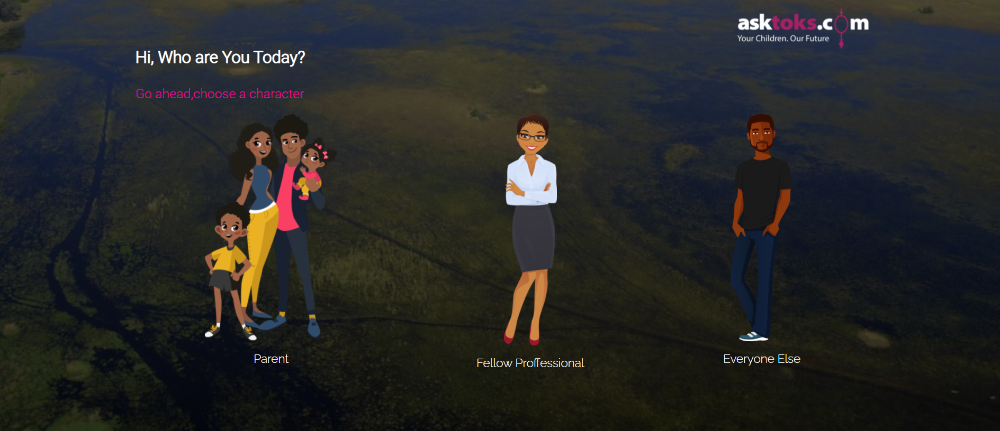

 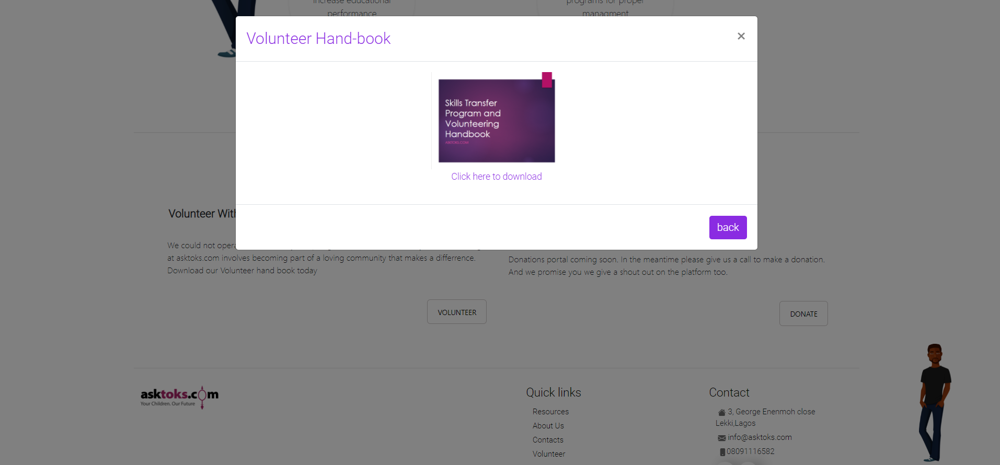  

 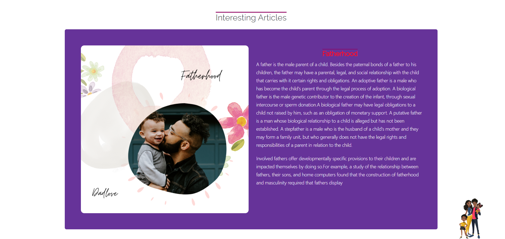  

  ##Small screen sizes ##
  
  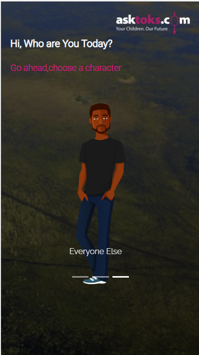  
   
  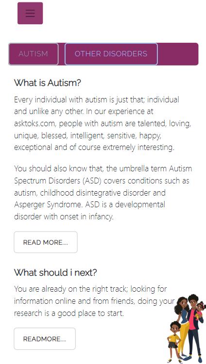  

  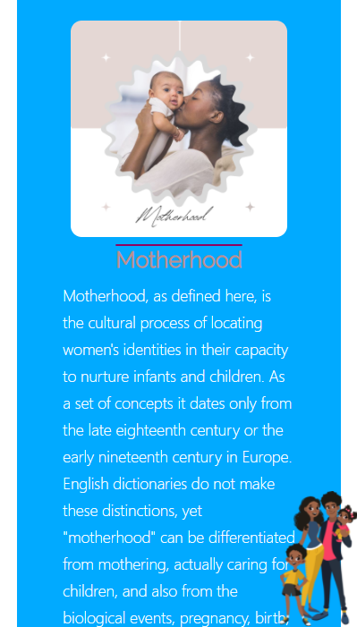

  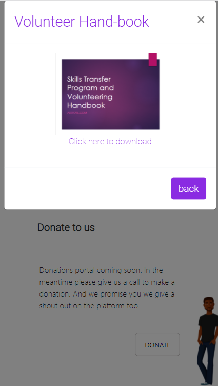    
            
   ##process##           
  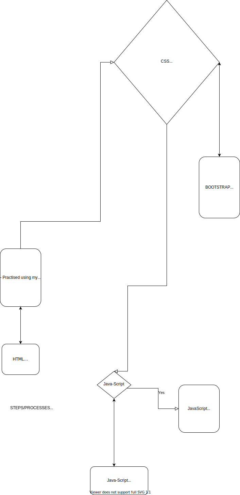  
 ##process##   

 ## Gallery
##Little mobile and laptop views too## 
    

  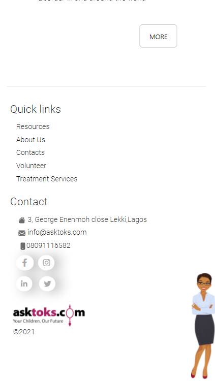 
         
  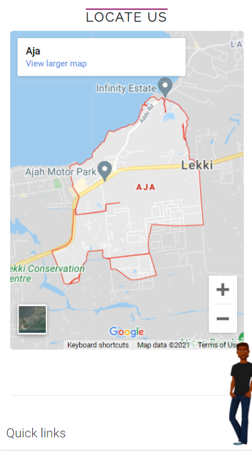 

 ## Built with         
      -HTML(Hypertext Mark-up Language)
      -CSS(Cascading Styles Sheet)
      -BOOTSTRAP
      -JS(Java-script)

 ## My Challanges and lessons
Learnt how to use bootstrap classes and terminologies, practised grids effectly, with equal distribution of sections.The javascript was quite tasking,but with careful concentration it was fun.

##Hover-effects##
Hover-effects are really useful syntax in css, it creates a little interaction between the user, coupled with a little animation, which improves the structure and movement on the website.

##Hover-effects description##

 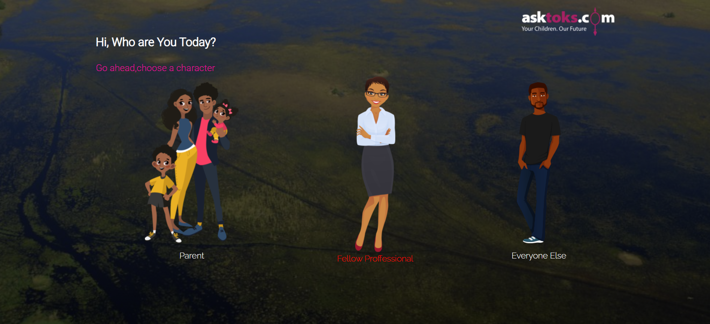                
            
 ## Installations
   -For those Farmiliar with Git-hub you can clone the repo and pull to your local workplace to view.
   -For those who ant to view you can download the file from here [https://wonderful-raman-39aaa1.netlify.app/], to view Thank you once again.
            

 ## Resources that helped ##
   -For the Colors[https://coolors.co/palettes/trending/blue]

   -For the icons[https://fontawesome.com/v5.15/icons/instagram?style=brands]

   -For the charts[https://app.diagrams.net/]

   -For the Font's[https://fonts.google.com/]
   
 ## Best syntax Used
    ``CSS
 (CSS grids, flex-box, box-shadow, and float).I really had fun with these syntax.The grids helped out in the complex layout of sections, while the flex-box and float helped with the placing of items adequately to prevent work from collapsing.
   ``
## Huge shout-out
Huge shout out to all the children out there suffering from autism or other challanges, i love you.

   ## Licsense 
   This work is under [MIT] liscence. It's highly free and opensource to anyone to use.
